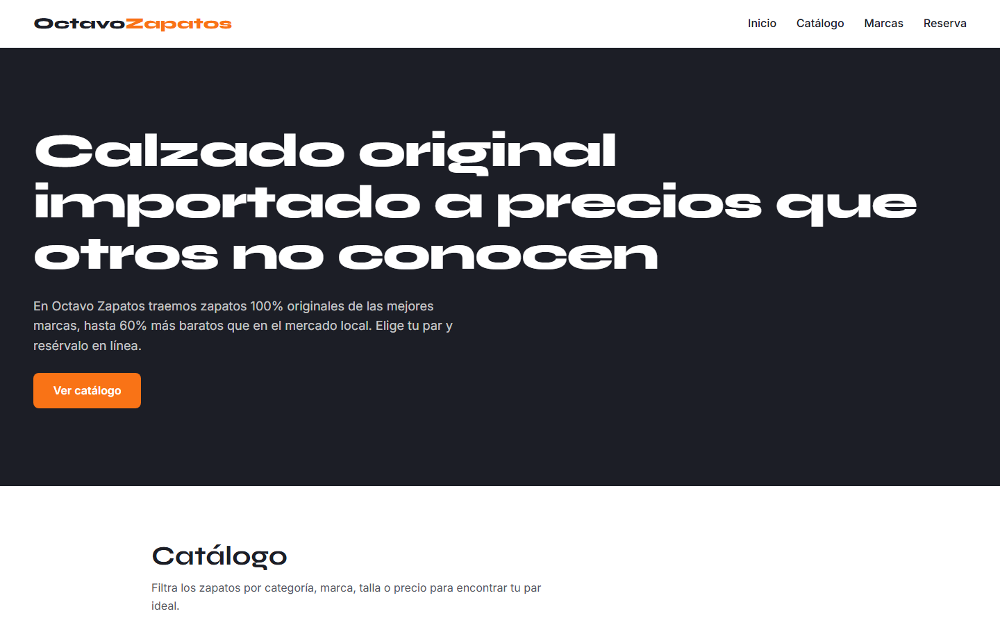
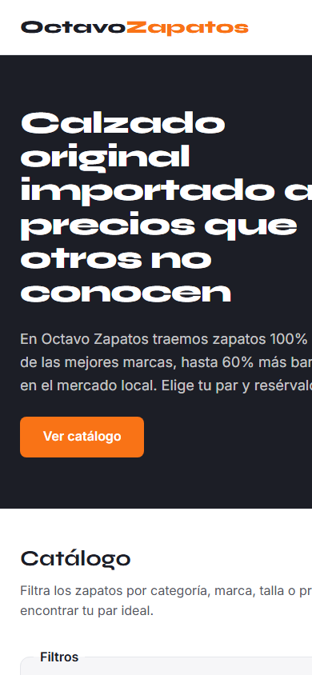

# Octavo — Tienda de zapatos

Esta es la página de presentación de Octavo, mi proyecto de calzado. Muestro el catálogo, las marcas que importo y un formulario donde puedes dejar tu reserva. Todo el sitio está hecho a mano con HTML, CSS y JavaScript, sin frameworks, para entender cada línea de lo que se ve.

**Ver en vivo:** https://tienda-zapatos-indol.vercel.app

## Capturas




## Qué hace

- Las tarjetas de zapatos, la lista de marcas y las opciones del formulario no están escritas en el HTML: JavaScript las genera recorriendo dos arreglos (`zapatos` y `marcas`, en `script.js`).
- Los filtros por categoría (botones), marca y talla (menús desplegables) y precio "menor a" funcionan a la vez. Cada cambio vuelve a filtrar el catálogo completo y avisa cuando no hay resultados.
- El formulario de reserva valida los campos antes de enviar y muestra los errores junto a cada campo, sin usar `alert()`. Si todo está bien, muestra un mensaje de éxito y limpia el formulario.
- El catálogo usa Grid con columnas automáticas, así que el número de columnas cambia según el ancho de la pantalla. En móvil aparece el menú hamburguesa.

## Estructura del proyecto

```
tienda-zapatos/
├── index.html   ← estructura semántica de la página
├── styles.css   ← estilos: variables, Flexbox, Grid y media queries
├── script.js    ← datos (arreglos de marcas y zapatos) + interacciones
├── images/      ← fotos del catálogo
└── README.md
```

## Datos y filtros

El sitio modela dos entidades relacionadas: zapatos (nombre, marca, categoría, precio, talla, descripción y foto) y marcas (nombre, descripción y país). Cada zapato pertenece a una marca, y de esa relación salen los filtros por marca, categoría, talla y precio.

## Cómo verlo en local

Clona el repo y abre `index.html` en el navegador, o sírvelo con:

```
python -m http.server
```

y entra a http://localhost:8000

## Despliegue

El sitio vive en Vercel, proyecto `octavo/tienda-zapatos`. Cada push a `main` redespliega automáticamente la página publicada.

## Lo que sigue

Para la Entrega 2 reemplazo los arreglos de JavaScript por una API real, para que el catálogo, las marcas y el formulario se sirvan desde un backend.